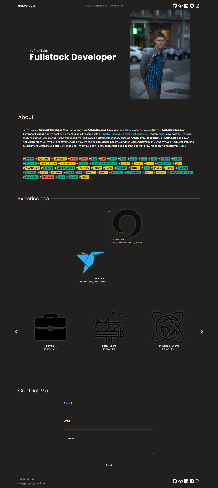
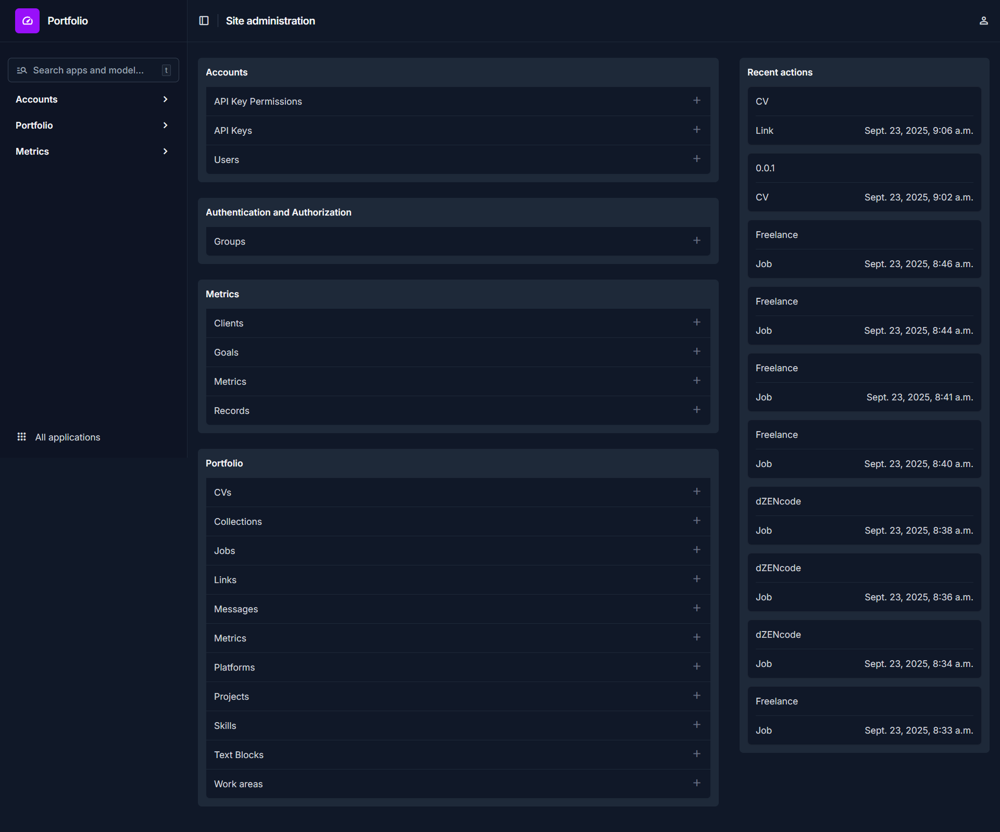

# Portfolio

<p align="center">

</p>

Fullstack portfolio site built with usage of modern technologies such as Django and Next.js

## Overview





## Stack

### Backend

- Python
- Django
- Django Rest Framework
- SimpleJWT
- DRF Spectacular
- Django Modeltranslation
- Django Filter
- PostgreSQL

### Frontend

- TypeScript
- Next.js
- React.js
- Tailwind CSS
- Framer Motion
- Flowbite React
- Prime React
- React Icons
- ZOD
- React Slick
- MDX

## Setup

Clone the repo

```bash
git clone https://github.com/CrazyProger1/Portfolio.git
cd portfolio
```

Backend setup

```bash
cd backend
python -m venv .venv
source .venv/bin/activate # or ".venv\Scripts\activate" on Windows
uv sync
uv run python manage.py migrate
uv run python manage.py runserver
```

Frontend setup

```bash
cd frontend
npm install

# For dev
npm run dev

# For usage
npm run build
npm run start
```

> Do not forget to provide .env variables for [backend](backend/.env.sample) and for [frontend](frontend/.env.sample)

## License

Portfolio is released under the MIT License. See the bundled [LICENSE](LICENSE) file for details.